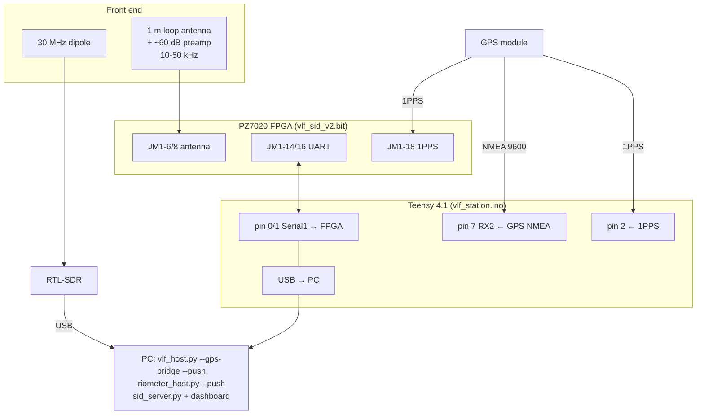

# freq-lab wiring reference

Every pin for every board, pulled from the Vivado constraint files
(`fpga/*/constraints/*.xdc`) and the sketch headers. All logic is **3.3 V**.
Common ground everywhere. Safety warnings (seizure flicker, kilovolt Kirlian
rig, on-body currents) are in each sketch's own header comment — read those
before powering anything on a person.

- [PZ7020-StarLite FPGA — JM1 header](#pz7020-starlite-fpga--jm1-header)
- [FPGA designs: what each one uses on JM1](#fpga-designs-what-each-one-uses-on-jm1)
- [Teensy 4.1 sketches](#teensy-41-sketches)
- [ESP32 Schumann generator](#esp32-schumann-generator)
- [STM32 + SX1262 RF resonance probe](#stm32--sx1262-rf-resonance-probe)
- [Full VLF SID station (FPGA + Teensy + GPS + SDR)](#full-vlf-sid-station)

---

## PZ7020-StarLite FPGA — JM1 header

Board: Puzhi PZ7020-StarLite, Zynq **xc7z020clg400-2**. JM1 is the 3.3 V
expansion header (BANK35/34). Every freq-lab FPGA design uses the same pins for
power, clock, UART, fan and LEDs; only the signal pins (6/8/9/10/11/12) differ.

| JM1 pin | FPGA ball | Signal (common) | Direction | Notes |
|---|---|---|---|---|
| 2 | — | 3.3 V | power out | powers an external preamp's output stage |
| 4 | — | GND | — | common ground |
| 5 | H16 | fan PWM | out | drives a 4-wire fan's PWM input |
| 7 | H17 | fan TACH | in | fan tach, needs pull-up (enabled in RTL) |
| 14 | B19 | UART TX | out | → USB-serial adapter RX (or Teensy RX1) |
| 16 | A20 | UART RX | in | ← USB-serial adapter TX (or Teensy TX1) |
| 18 | C20 | GPS 1PPS | in | 3.3 V 1PPS, pulled down (reads "no GPS" if open) |
| — | U18 | 50 MHz clock | in | on-board oscillator |
| — | R19 | LED1 (heartbeat) | out | 1 Hz = fabric running |
| — | V13 | LED2 (activity) | out | per-design meaning |
| — | G14 | KEY1 | in | active-low, held = fan 100 % |

Signal pins that differ per design (all 0–1.0 V max on the XADC analog pins):

| JM1 pin | FPGA ball | Used by | Signal |
|---|---|---|---|
| 6 | E17 | lockin, photon, correlator, vlf_sid(+v2) | ADC+ / ANTENNA+ / detector A (VAUX1P) |
| 8 | D18 | same | ADC− / ANTENNA− / detector B ground (VAUX1N) |
| 9 | E18 | correlator | ADC B+ (VAUX9P) |
| 11 | E19 | correlator | ADC B− (VAUX9N) |
| 10 | F16 | lockin | sigma-delta drive out (needs RC low-pass) |
| 10 | — | photon_counter | `gate` (counting enable, tie 3.3 V for always-on) |
| 12 | F17 | lockin | sync out (square wave at the drive frequency) |

`trng` uses no analog pins (its XADC reads the on-chip temperature only).

```mermaid
flowchart LR
  PC["PC (USB)"] <-->|3.3V serial| ADP["USB-serial adapter"]
  ADP -->|TX→RX| P14["JM1-14 FPGA TX"]
  ADP <--|RX←TX| P16["JM1-16 FPGA RX"]
  GPS["GPS module"] -->|1PPS| P18["JM1-18 (C20)"]
  SENS["sensor / antenna preamp<br/>0..1.0 V"] -->|signal| P6["JM1-6 (E17)"]
  SENS -->|ground| P8["JM1-8 (D18)"]
  V33["JM1-2 3.3V"] --> SENS
  P14 --- FPGA[("PZ7020<br/>xc7z020")]
  P16 --- FPGA
  P18 --- FPGA
  P6 --- FPGA
  P8 --- FPGA
```

### Load a bitstream (RAM only; a power cycle restores the board)

```
cd fpga/<design>      (e.g. vlf_sid_v2, trng)
vivado -mode batch -source program.tcl
```

---

## FPGA designs: what each one uses on JM1

### lockin (digital lock-in amplifier)
```
JM1-6  ADC+ 0..1.0 V        JM1-8  ADC- -> GND at the sensor
JM1-10 drive -> 1kΩ -> node -> 10nF -> GND   (node = analog sine, 0..3.3 V)
JM1-12 sync  (square wave at the drive frequency)
JM1-14 TX / JM1-16 RX  -> USB-serial adapter
Loopback cal: node -> 33kΩ -> JM1-6, 10kΩ from JM1-6 to GND, JM1-8 to JM1-4.
```

### photon_counter (two-detector coincidence)
```
JM1-6  det_a  (3.3 V logic, rising edge = photon)
JM1-8  det_b
JM1-10 gate   (active high; tie to 3.3 V for always-on)
JM1-14 TX / JM1-16 RX
```

### correlator (two-channel cross-correlator)
```
JM1-6  VAUX1+ ch A (0..1.0 V)   JM1-8  VAUX1- -> GND at sensor
JM1-9  VAUX9+ ch B (0..1.0 V)   JM1-11 VAUX9- -> GND at sensor
JM1-18 GPS 1PPS (optional, for multi-station sync)
JM1-14 TX / JM1-16 RX
```

### vlf_sid and vlf_sid_v2 (8-station VLF SID receiver; v2 adds lightning TOA)
```
loop antenna (1 m, ~10 turns) -> preamp ~60 dB, 10-50 kHz, bandlimited <60 kHz
  -> 0.5 V bias -> 100Ω -> JM1-6 (ANTENNA+)   + 2.2nF to JM1-8 (ANTENNA-)
JM1-18 GPS 1PPS      JM1-14 TX / JM1-16 RX
Run the preamp's last stage from JM1-2 (3.3 V) so it cannot exceed 3.3 V.
```

### trng (ring-oscillator TRNG)
```
JM1-14 TX / JM1-16 RX   (no analog pins; XADC reads on-chip temperature)
```

---

## Teensy 4.1 sketches

Pin numbers are Teensy 4.1 digital pins. `A0=14, A1=15, A2=16, A3=17`.
`Serial1 = pin 0 (RX1) / pin 1 (TX1)`, `Serial2 = pin 7 (RX2) / pin 8 (TX2)`.

### resonance_sweep / body_resonance (MPU-6050 vibration)
```
MPU-6050 #0:  SDA -> pin 18,  SCL -> pin 19,  VCC 3.3 V,  GND
body_resonance: up to 6 MPU-6050 on the same I2C bus (AD0 strapping for addresses)
exciter (shaker/buzzer): any PWM/DAC pin to its driver (resonance_sweep)
```

### elf_logger (0.25–45 Hz ELF spectrum)
```
A0 (14) <- amplifier output, 0..3.3 V centred on 1.65 V
pin 0 (RX1) <- GPS TX (NMEA 9600)      pin 2 <- GPS 1PPS      (both optional)
SD card in the Teensy slot
Front end: coil or two electrodes -> instrumentation amp gain ~1000 -> 1.65 V bias -> A0
```

### hemisync_gen (binaural beats)
```
MQS audio (no audio board):
  pin 12 -> 220Ω -> 10µF(+ to pin) -> headphone LEFT
  pin 10 -> 220Ω -> 10µF(+ to pin) -> headphone RIGHT
  GND -> headphone sleeve
pin 2 -> square wave at pair-0 beat frequency (marker)
```

### strobe_driver (flashing-light stimulator — read the header's seizure warning)
```
pin 5 -> channel A LED driver   pin 6 -> channel B LED driver
pin 3 -> flash marker           pin 4 -> trial marker
pin 7 <- external trigger in    A0 (14) <- light sensor for `check`
pin 8 <- ABORT button to GND (internal pull-up; kills the light in the ISR)
LED: pin -> 470Ω -> LED -> GND  (small)  or  pin -> 100Ω -> MOSFET gate (bright)
```

### cc1101_scanner (sub-GHz spectrum)
```
CC1101 via SPI0: pin 10 CS, pin 11 MOSI, pin 12 MISO, pin 13 SCK,
                 pin 2 GDO0 (optional), 3.3 V, GND
second CC1101 (optional): pin 9 CS2, SPI bus shared
```

### schumann_monitor (ADS1256 24-bit, H + E channels)
```
ADS1256: pin 13 SCK, pin 11 MOSI(DIN), pin 12 MISO(DOUT), pin 10 CS,
         pin 9 DRDY, pin 8 RESET, 5 V, GND
  AIN0/AIN1 = H channel (induction coil + preamp)
  AIN2/AIN3 = E channel (ball antenna + electrometer)
pin 0 (RX1) <- GPS NMEA 9600    pin 2 <- GPS 1PPS    SD card in the slot
```

### rf_survey (AD8318 RF power meter)
```
AD8318 module: VCC 5 V, GND, VOUT -> 10kΩ -> A0 (14), 10nF A0->GND
antenna/filter -> AD8318 RF input (SMA)
pin 0 (RX1) <- GPS NMEA 9600 (for `survey`)   pin 3 -> pulse marker   SD card
```

### sleep_cue (closed-loop sleep cueing — battery power only with electrodes on)
```
A0 (14) <- EEG front end (0.3-45 Hz, centred 1.65 V; Fpz active, mastoid ref)
A1 (15) <- EMG front end (optional; `emg off` uses the EEG high band)
MQS audio: pin 12 -> 470Ω -> 10µF -> earbud L,  pin 10 -> ... -> R,  GND sleeve
pin 3 -> cue marker.   SD card holds CUE###.WAV, logs, the sealed key.
```

### kirlian_logger (controlled Kirlian — build the interlocked HV rig from a documented circuit)
```
A0 (14) GSR: electrode->skin->electrode->100kΩ->3.3 V; junction -> A0
A1 (15) FSR pressure: FSR 3.3 V->A1, 10kΩ A1->GND
A2 (16) corona photodiode (transimpedance amp)
A3 (17) HV-present pickup (isolated, 1M/1nF + diode detector)
pin 2 -> HV ENABLE (to the interlock; high only during an armed exposure)
pin 3 -> camera trigger     pin 4 <- foot/hand switch to GND (held to expose)
This board MEASURES and interlocks only; it does NOT generate the high voltage.
```

### nuisance_logger (signal + vibration/B-field/sound/mains veto)
```
A0 (14) SIGNAL    A1 (15) B-FIELD (fluxgate/coil)
A2 (16) SOUND (electret mic + amp)    A3 (17) MAINS pickup (buffered)
MPU-6050 (vibration): SDA pin 18, SCL pin 19, 3.3 V, GND     SD card
```

### vlf_station (GPS-aware bridge for the VLF station) and fpga_uart_bridge
```
FPGA UART : pin 0 (RX1) <- FPGA JM1-14 (TX),  pin 1 (TX1) -> FPGA JM1-16 (RX)
GPS NMEA  : pin 7 (RX2) <- GPS TX (9600)
GPS 1PPS  : GPS PPS -> pin 2  AND -> FPGA JM1-18   (one line, two inputs)
GND common: Teensy GND -- FPGA JM1-4 -- GPS GND
```

---

## ESP32 Schumann generator

`ESP32` (classic, WROOM-32/32E — has the DAC). The ESP32-S3 variant uses LEDC
PWM + an RC filter in place of the DAC (GPIO17).

```
GPIO25 (DAC1) -> waveform 0..3.3 V (centred 1.65 V)   [S3: GPIO17 PWM 78 kHz -> 10kΩ -> 100nF]
coil driver: DAC -> op-amp gain 1..3 (e.g. LM358, input biased 1.65 V)
          -> complementary emitter follower (BD139/BD140) -> coil -> R_SENSE -> GND
GPIO34 (ADC) <- top of R_SENSE through 10kΩ, 100nF to GND   (0..3.3 V)
GPIO35 (ADC) <- optional Hall/fluxgate analog out (for `verify a`)
GPIO27       <- optional fluxgate frequency output (for `verify f`)
GPIO0 (BOOT) <- marks threshold in `phosphene` mode / stop
GPIO2        -> LED (on while the field is on)
Phone page: Wi-Fi AP "SCHUMANN-xxxx", password schumann1
```

---

## STM32 + SX1262 RF resonance probe

Written for the DX-LR20 LoRa kit (STM32 + SX1262). Change the four pin defines
for your board.

| SX1262 | STM32 (default) | Teensy | ESP32/generic |
|---|---|---|---|
| NSS (CS) | PA4 | 10 | configure in sketch |
| DIO1 | PB1 | 3 | |
| NRST | PB0 | 5 | |
| BUSY | PA3 | 4 | |
| MOSI/MISO/SCK | board SPI defaults | | |

Two boards, two antennas facing each other with room for the sample between.
Build for STM32 with `stm32/rf_resonance/build.bat` (passes RadioLib's pin casts
that the STM32 core 3.x needs).

---

## Full VLF SID station

Reference rig: PZ7020 FPGA + Teensy 4.1 (GPS-aware bridge) + ESP32-32E (spare)
+ RTL-SDR + GPS/PPS. Full run sequence and the GPU-rig caveat: `docs/station-setup.md`.
The RTL-SDR cannot receive VLF (24 kHz) directly — it does the 30 MHz riometer
complement; the FPGA does VLF at 390 kS/s.



Timing: the one GPS 1PPS line fans out to both the Teensy (pin 2) and the FPGA
(JM1-18). NMEA goes to the Teensy on Serial2 so Serial1 stays free for the FPGA.
`vlf_host.py --gps-bridge` then stamps every window with true GPS UTC.
